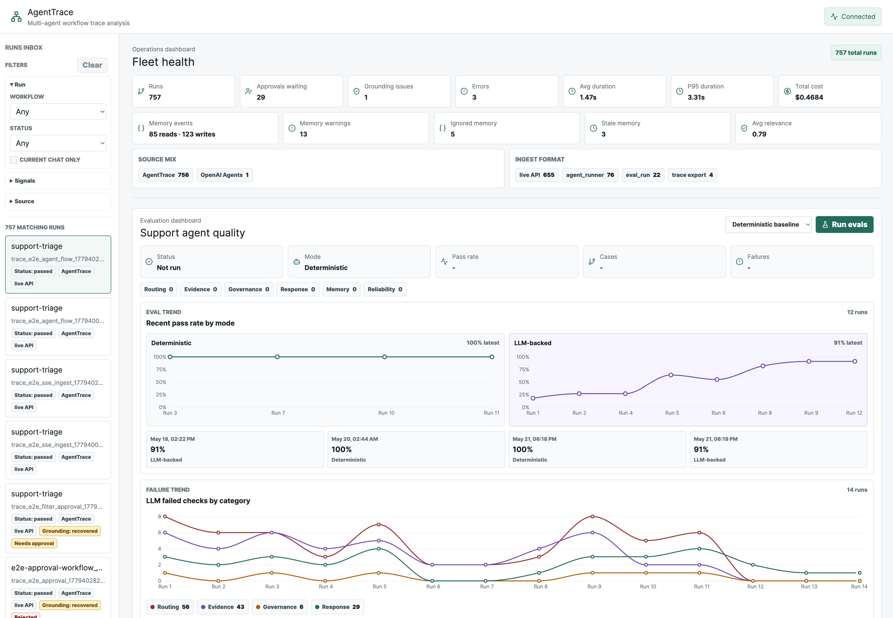

# AgentTrace

AgentTrace is a trace operations dashboard for debugging, monitoring, and
evaluating multi-agent AI workflows. The repo includes a customer-service
multi-agent app as the reference workload, so the dashboard can observe real
chat turns, tool calls, handoffs, approvals, grounding, latency, token/cost
metadata, and eval results.

<p align="center">
  
</p>

## What Is Included

- FastAPI AgentTrace API with SQLite storage.
- React/TypeScript dashboard built with Vite and pnpm.
- Standalone customer-service agent service under `agent_apps/customer_service`.
- FastMCP tool service for customer, policy, order, charge, and action tools.
- OpenAI Agents-style trace import and normalization.
- SSE updates for runs, chat, traces, summaries, and eval progress.
- Deterministic and LLM-backed support-triage evals.
- Dockerized Playwright e2e tests.

## Architecture

```text
Dashboard / Customer Service App
        |
AgentTrace API --------------- SQLite
        |
Customer-Service Agent Service
        |
Multi-Agent Orchestrator
   |-- MCP tools
   |-- memory
   |-- policy retrieval
   |-- approval gates
   `-- OpenAI-compatible model client
            |
      OpenAI | Gemini | gateway | local LLM
```

The agent is provider-agnostic. Real model calls use OpenAI-compatible
`/v1/chat/completions` by default, so provider changes stay in environment
configuration rather than specialist-agent logic.

## Quick Start

```bash
docker compose up -d --build api web agent-service mcp-tools
```

Open:

```text
Dashboard: http://localhost:5173
API docs:  http://localhost:8000/docs
Agent:     http://localhost:8020/health
MCP tools: http://localhost:8010/health
```

Local data is stored in `.agenttrace/agenttrace.db`.

## Demo Flow

1. Open `http://localhost:5173`.
2. Send a message in **Live customer-service agent**:

   ```text
   I was charged twice for my Pro subscription yesterday. Can I get a refund?
   ```

3. Open the generated trace and inspect the Agent Flow.
4. Run **Support agent quality** evals.
5. Review failed checks and the improvement plan.

Useful multi-turn case:

```text
I'd like to return the banana I bought last week. I ate all of them already.
```

Then:

```text
Order number: #1234
```

The agent should preserve the active issue, avoid unrelated duplicate-charge
leakage, and explain the consumed-product return boundary.

## Model Configuration

Create:

```text
agent_apps/customer_service/.env
```

Use `agent_apps/customer_service/.env.example` as the template.

Gemini example:

```env
LLM_PROVIDER=gemini
GEMINI_API_KEY=...
GEMINI_MODEL=gemini-2.5-flash
GEMINI_FALLBACK_MODELS=gemini-2.5-flash-lite
GEMINI_BASE_URL=https://generativelanguage.googleapis.com/v1beta/openai
AGENTTRACE_LLM_TIMEOUT_SECONDS=180
```

OpenAI-compatible gateway example:

```env
LLM_PROVIDER=openai-compatible
LLM_API_KEY=...
LLM_MODEL=...
LLM_FALLBACK_MODELS=...
LLM_BASE_URL=http://gateway.example/v1
```

After changing `.env`:

```bash
docker compose up -d --force-recreate agent-service api
```

## Service Configuration

Each deployable service owns its own environment file:

```text
agenttrace/api/.env              # API auth, storage, agent-service URL
agent_apps/customer_service/.env # LLM provider/model/API keys and agent runtime
web/.env                         # browser-visible Vite config only
```

Use the matching `.env.example` file in each service directory as the template.
Do not put LLM keys or admin tokens in `web/.env`.

## Optional Auth

Auth is disabled by default for local demos. To protect the dashboard/API, set:

```env
AGENTTRACE_AUTH_ENABLED=true
AGENTTRACE_ADMIN_TOKEN=long-random-secret
# Optional narrower tokens:
AGENTTRACE_OPERATOR_TOKEN=long-random-secret
AGENTTRACE_VIEWER_TOKEN=long-random-secret
```

Put those values in `agenttrace/api/.env`, then recreate the API container:

```bash
docker compose up -d --force-recreate api web
```

When enabled, the dashboard shows a token login screen. The backend validates
the token once and sets an httpOnly, signed, expiring session cookie; the
frontend does not store the secret and the cookie value is not the admin token.
Admin and operator sessions can approve, reject, and revert approval gates.
Viewer sessions can read dashboards and traces but cannot mutate approvals.
`/health`, `/auth/status`, `/auth/login`, and `/auth/logout` stay public.
Dashboard, trace, chat, eval, workflow, approval, and SSE routes require auth.

## Evals

Run from the dashboard or API:

```bash
curl -X POST http://localhost:8000/evals/support-triage/run
curl -X POST 'http://localhost:8000/evals/support-triage/run?mode=llm'
curl http://localhost:8000/eval-runs/support-triage/comparison
```

Run from CLI:

```bash
python3 -m agenttrace.cli eval support-triage
python3 -m agenttrace.cli eval support-triage --mode llm
python3 -m agenttrace.cli eval support-triage --json
```

Deterministic evals are the stable baseline. LLM-backed evals measure the
configured provider/model and can be resumed when provider rate limits or
capacity errors interrupt a run.

## CLI

```bash
docker compose run --rm agenttrace import examples/support_triage/sample_trace.json
docker compose run --rm agenttrace list
docker compose run --rm agenttrace show trace_support_triage_happy_path
docker compose run --rm agenttrace show trace_support_triage_happy_path --verbose
```

Import an OpenAI Agents-style export:

```bash
docker compose run --rm agenttrace import examples/openai_agents/sample_trace_export.json --format openai-agents
```

## API

API docs are available at `http://localhost:8000/docs`.

Common endpoints:

```text
GET    /health
GET    /dashboard/summary
GET    /events

POST   /chat/sessions
POST   /chat/sessions/{session_id}/messages

POST   /workflows/support-triage/runs
GET    /workflow-runs/{run_id}
POST   /workflow-runs/{run_id}/cancel
POST   /workflow-runs/{run_id}/retry

GET    /evals
POST   /evals/support-triage/run
POST   /eval-runs/{run_id}/resume
GET    /eval-runs

GET    /traces
POST   /traces
GET    /traces/{trace_id}
GET    /traces/{trace_id}/raw
POST   /ingest/openai-agents
POST   /traces/{trace_id}/approvals/{span_id}/approve
POST   /traces/{trace_id}/approvals/{span_id}/reject
POST   /traces/{trace_id}/approvals/{span_id}/revert
```

## Development

The API entry point is `agenttrace/api/main.py`. Domain routes live under
`agenttrace/api/routes/`, while agent delegation, eval helpers, chat helpers,
approval mutations, and SSE publishing live in focused `agenttrace/api/*.py`
modules. SQLite persistence keeps schema DDL, row mapping helpers, and store
behavior split across `agenttrace/storage/sqlite_schema.py`,
`agenttrace/storage/sqlite_helpers.py`, and `agenttrace/storage/sqlite.py`.
Eval orchestration remains import-compatible through
`agenttrace/evals/support_triage.py`, with case definitions, result models,
reporting, and trace assertion helpers split into focused `agenttrace/evals/*`
modules.

The customer-service agent entry point remains
`agent_apps/customer_service/runner.py`. Model gateway, MCP/local tools,
policy logic, validation, prompt metadata, static/default runner construction,
workflow context, response generation, and trace/span construction are split
into focused modules in the same package.

Python:

```bash
python3 -m venv .venv
source .venv/bin/activate
python -m pip install --upgrade pip
python -m pip install -e .
python -m unittest discover
```

Frontend:

```bash
cd web
corepack pnpm install
corepack pnpm lint
corepack pnpm test
corepack pnpm build
corepack pnpm dev
```

Global styles are composed from `web/src/styles.css`, which imports focused
section styles from `web/src/styles/`.

E2E:

```bash
docker compose run --rm --build e2e
```

The Playwright report is written to `e2e/playwright-report/index.html`.
Auth-enabled e2e coverage is included and runs when the API has auth enabled and
`PLAYWRIGHT_AUTH_TOKEN` is set for the `e2e` service.

CI runs backend tests, deterministic evals, frontend tests/build, and Dockerized
Playwright e2e on pushes to `development`.
